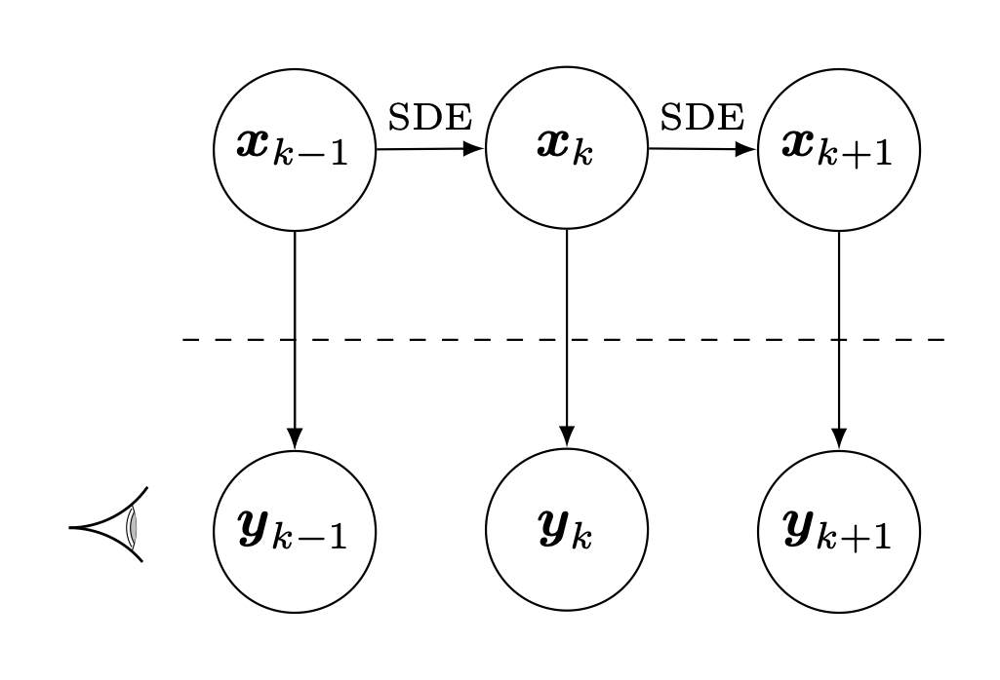

# State-Space Methods

The **Argus** analysis framework is built on a state-space representation of the pulsar timing problem. Pulsar Timing Arrays (PTAs) use millisecond pulsars as cosmic clocks to detect gravitational waves and other astrophysical signals. By precisely measuring the arrival times of radio pulses from an array of pulsars, PTAs can identify correlated perturbations caused by gravitational waves passing between Earth and the pulsars. Argus provides a computationally efficient and flexible approach to analyzing PTA data by modeling the problem as a dynamical system evolving in time.

This document provides a technical overview of the state-space method and its advantages over traditional frequency-domain techniques.

-----

## State-Space Models

A state-space model describes a dynamical system using a pair of equations: one that governs the evolution of an unobserved (or "latent") **state vector**, and one that relates this hidden state to the observable measurements. This formulation is well-suited to the PTA problem, where signals of interest like gravitational waves are hidden processes that manifest in the noisy time-of-arrival (TOA) data.

A linear state-space model is defined by two primary equations:

### 1. The State Equation (Transition Equation)

This equation describes how the hidden state, $x_t$, evolves from one time step to the next according to its internal dynamics.

$$x_{t} = F x_{t-1} + w_{t}$$

  * $x_t$ is the **state vector** at time $t$. In a PTA context, this vector can contain the gravitational wave background amplitude, pulsar spin noise, and other time-varying parameters.
  * $F$ is the **transition matrix**, which encodes the physics of the evolution (e.g., how a stochastic signal changes over a time step).
  * $w_t$ is the **process noise**, representing random, unmodeled changes to the state. It is a random variable with covariance $Q$.

### 2. The Observation Equation (Measurement Equation)

This equation links the hidden state $x_t$ to the measured data, $y_t$.

$$y_{t} = H x_{t} + v_{t}$$

  * $y_t$ is the **observation vector** at time $t$. For PTAs, this is the vector of pulsar timing residuals from all pulsars in the array at time $t$.
  * $H$ is the **observation matrix**, which maps the hidden state to the observables. For example, it contains the geometric factors ("antenna patterns") that project the gravitational wave signal onto the line of sight for each pulsar.
  * $v_t$ is the **observation noise**, representing measurement errors (e.g., radiometer noise). It is a random variable with covariance $R$.

This framework separates the model of the underlying physics ($F, Q$) from the measurement process ($H, R$), providing a clean and powerful structure for the problem.

-----

## The Kalman Filter Algorithm

The **Kalman filter** is a recursive algorithm for inferring the latent state $x_t$ of a state-space model from a sequence of observations $y_1, y_2, \dots, y_t$. It operates via a two-step loop:

1.  **Predict:** The filter uses the state equation to predict the state for the next time step, $x_t$, based on the estimate at $t-1$. It also propagates the uncertainty of this prediction.
2.  **Update:** When the new observation $y_t$ becomes available, the filter compares this measurement to its prediction. The difference (the "innovation") is used to correct the state estimate, reducing its uncertainty.

For linear models with Gaussian noise, the Kalman filter is the **optimal estimator** in the sense that it minimizes the mean squared error of the state estimate. To build intuition for this recursive process, you can explore our [interactive visualization tool](https://unimelb-nsgw.github.io/kalman-filter-viz/).

The Kalman filter is also a powerful tool for Bayesian parameter estimation in PTA analysis. For details on how Argus uses the Kalman filter for Bayesian inference with JAX and NumPyro, see [Bayesian Inference with the Kalman Filter](bayesian_inference.md).

-----

## Key Advantages for PTA Data Analysis

The state-space approach offers several advantages for the specific challenges of PTA data.

### 1. Computational Speed and Scalability

The Kalman filter processes data sequentially, providing excellent computational efficiency:

  * **Linear Time Complexity:** The likelihood calculation scales as $O(T)$, where $T$ is the number of observation epochs. This enables the analysis of datasets with high cadence and long time baselines.
  * **Minimal Memory Footprint:** The algorithm only needs to store the current state vector and its covariance matrix (typically small, $\sim 10$-$100$ dimensions).
  * **GPU/TPU Friendly:** The core operations are small, batched matrix multiplications, which are well-suited for modern accelerators and just-in-time (JIT) compilation.

### 2. Natural Handling of Data Imperfections

PTA datasets are characterized by irregular sampling, gaps, and time-variable noise properties. The state-space formulation handles these naturally:

  * **Irregular Sampling:** Unevenly spaced TOAs are handled natively without requiring resampling or interpolation.
  * **Missing Data:** Gaps in observations (e.g., due to telescope downtime or unfavorable observing conditions) are handled automatically by the prediction step, which propagates the state forward in time even when no measurements are available.
  * **Heteroskedastic Noise:** Time-varying measurement noise (e.g., changing EFAC/EQUAD values across observing epochs) is handled by using a unique observation noise matrix $R_t$ at each time step.

### 3. Principled Modeling of Complex Dynamics

The state-space framework provides flexible modeling of complex physical processes:

  * **Time-Varying Physics:** The model can accommodate time-varying dynamics (e.g., an evolving gravitational wave background spectrum) by allowing the transition matrix $F_t$ and process noise $Q_t$ to vary with time.
  * **Glitches and Events:** Sudden events like pulsar glitches or dispersion measure (DM) events can be modeled as explicit jump-states or by modifying the state equation at specific epochs.
  * **Exact Likelihood:** Given the model assumptions (linear dynamics, Gaussian noise), the filter provides a method (the prediction-error decomposition) to calculate the exact Gaussian likelihood of the data.

### 4. Modular and Interpretable Physical Models

A complex physical model can be constructed intuitively by adding different effects as blocks to the state vector $x_t$.

  * **Flexible Model Building:** Different noise processes (red noise, DM variations, GWB signals) can be added or removed from the state vector independently, making it straightforward to compare models or test hypotheses.
  * **Interpretability:** The algorithm yields estimates of the hidden state's trajectory over time, allowing for direct visualization and interpretation of the inferred signals in the time domain.

### 5. Support for Online and Incremental Analysis

The recursive nature of the Kalman filter is ideal for ongoing experiments.

  * **Sequential Updates:** As new TOAs are collected, they can be assimilated to update the current state estimate without rerunning the entire analysis from scratch. This is particularly valuable for multi-year datasets where reprocessing all historical data with each new observation would be computationally expensive.
  * **Rapid Science Results:** This enables near-real-time monitoring of pulsar timing behavior and allows for rapid updates to scientific results as new data becomes available, facilitating timely responses to transient events or emerging signals.

-----

## When to use state-space methods for PTA Analysis

The state-space approach in Argus is particularly well-suited for:

1. Large datasets with thousands of TOAs
2. Data with irregular sampling or significant gaps
3. Real-time or incremental analysis workflows
4. Modeling time-varying or non-stationary processes
5. Scenarios with limited computational resources (memory or time)
6. Analyses requiring independent verification with different modeling assumptions and numerical implementations

-----

## Further Reading

### Documentation

- [Kalman Filter Mathematics](kalman_mathematics.md) - Detailed mathematical formulation of the Kalman filter for PTAs
- [Bayesian Inference](bayesian_inference.md) - How the Kalman filter enables efficient Bayesian parameter estimation
- [Bayesian Implementation](bayesian_implementation.md) - Advanced parameterization techniques for high-dimensional inference
- [Getting Started](getting_started.md) - Run your first state-space PTA analysis

### Academic Papers

#### State-Space Methods for PTAs

- [arXiv:2409.14613](https://arxiv.org/abs/2409.14613) - Introduction to state-space methods for pulsar timing arrays
- [arXiv:2410.10087](https://arxiv.org/abs/2410.10087) - Computational techniques and benchmarks
- [arXiv:2501.06990](https://arxiv.org/abs/2501.06990) - Applications to real PTA datasets

#### Kalman Filtering Theory

- [Kalman (1960)](https://doi.org/10.1115/1.3662552) - "A New Approach to Linear Filtering and Prediction Problems" (the original paper)
- [Grewal & Andrews (2014)](https://doi.org/10.1002/9781118984987) - "Kalman Filtering: Theory and Practice Using MATLAB"
- [Särkkä (2013)](https://doi.org/10.1017/CBO9781139344203) - "Bayesian Filtering and Smoothing"

#### Gravitational Wave Background and Hellings-Downs Correlation

- [Hellings & Downs (1983)](https://doi.org/10.1086/160707) - "Upper limits on the isotropic gravitational radiation background from pulsar timing analysis"
- [arXiv:2105.13270](https://arxiv.org/abs/2105.13270) - NANOGrav 12.5-year detection of the gravitational wave background

### Interactive Resources

- [Kalman Filter Visualization](https://unimelb-nsgw.github.io/kalman-filter-viz/) - Interactive tool to build intuition for the predict-update cycle

-----
